<p align="center">
  <a href="./sxg.en.md">English</a> | <a href="./sxg.ko.md">한국어</a>
</p>

# 1. What is SXG (Signed Exchange)?

## 1.1 Definition

Signed Exchange (SXG) is a standard technology that allows third parties (e.g., CDNs) to deliver web resources while maintaining the integrity and origin of the content.

When Server A ([a.com](http://a.com)) creates an SXG file (index.sxg) and distributes it to a third-party Server B ([b.com](http://b.com)), even if a user requests [b.com/index.sxg](http://b.com/index.sxg), the browser treats it as if it came from the original domain ([a.com](http://a.com)).

Therefore, SXG is a delivery mechanism that can authenticate the original origin regardless of how the resource is delivered.

## 1.2 Key Features

- Maintains original origin even when content is delivered by third parties (CDN, search engines)
- Tamper prevention and trust verification
- Improved initial loading performance through prefetch support

## 1.3 Scope

- Primarily for static HTML
- SXG is supported in Chromium-based browsers (Chrome 73+, Edge 79+, Opera 64+)

# 2. How It Works

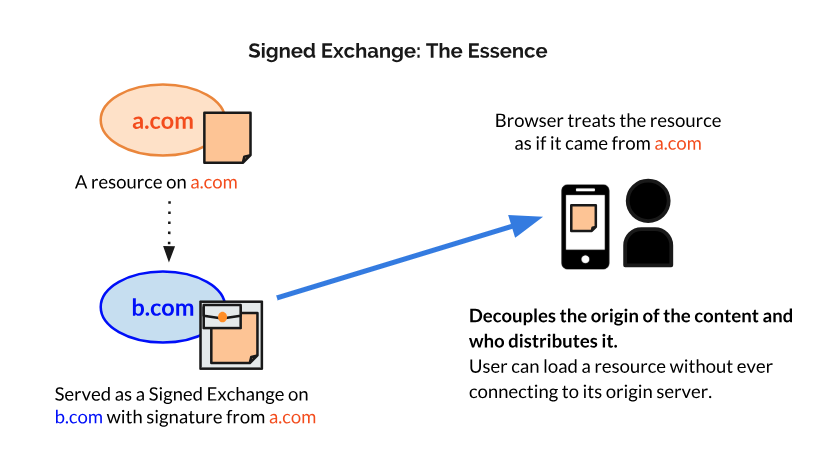
- Source: https://developer.chrome.com/blog/signed-exchanges

SXG operates through the following steps:

1. The origin server (`a.com`) generates an HTTP response (headers + body) and signs it with an X.509 certificate.
2. The signed exchange file (.sxg) is created and distributed to an external server (`b.com`, e.g., CDN or cache).
3. When a user requests the resource, the external server (`b.com`) delivers the SXG file.
4. The browser verifies the signature to confirm that the content came from the original origin and has not been tampered with, then displays the original URL (`a.com`) in the address bar.

In other words, the content origin and distribution entity are separated, allowing content to be published on the web without depending on specific servers, connections, or hosting services.

# 3. Hands-on Tutorial

> **Warning**
>
> - **SXG works on HTTPS web servers by default. This tutorial covers the process of creating private certificates for HTTPS web server setup. After creating private certificates, you must add the CA certificate to the system certificate store and configure it as 'trusted' for the browser to trust the certificate.**
> - **For local testing, we use localhost as the domain.**

## 3.1 Installing Tools: gen-certurl, gen-signedexchange

To implement SXG, install the `gen-signedexchange` and `gen-certurl` tools. These tools require Go, so Go language must be installed.

> ref. https://github.com/WICG/webpackage/tree/main/go/signedexchange#creating-our-first-signed-exchange

```bash
# Install signed-exchange tools
go install github.com/WICG/webpackage/go/signedexchange/cmd/gen-certurl@latest
go install github.com/WICG/webpackage/go/signedexchange/cmd/gen-signedexchange@latest

# Set environment variable
export PATH=$PATH:$(go env GOPATH)/bin
```

## 3.2 Certificate Generation

To serve SXG, you need an HTTPS web server. However, since this is a practice environment, we will create and use private Root CA (Certificate Authority) certificates and server certificates.

### 3.2.1 Root CA Certificate Generation: ca.crt, ca.key

Create the OpenSSL configuration file `ca.cnf` for Root CA generation.

> `CA:TRUE` is an extension field that specifies that this certificate can act as a CA, granting authority to sign subordinate certificates (server certificates, etc.).

📄 ca.cnf

```bash
[ req ]
default_bits       = 4096
prompt             = no
default_md         = sha256
distinguished_name = dn
x509_extensions    = ca_ext

[ dn ]
CN = Signed Exchange Demo - Root CA

[ ca_ext ]
basicConstraints = critical, CA:TRUE, pathlen:0
keyUsage = critical, keyCertSign, cRLSign
subjectKeyIdentifier = hash
authorityKeyIdentifier = keyid:always
```

Generate the Root CA private key (`ca.key`) and certificate (`ca.crt`) using the `ca.cnf` file.

```bash
# Generate Root CA private key: ca.key
openssl genrsa -out ca.key 4096

# Generate Root CA certificate: ca.crt
openssl req -x509 -new \
  -key ca.key \
  -out ca.crt \
  -days 1 -sha256 \
  -config ca.cnf \
  -extensions ca_ext
```

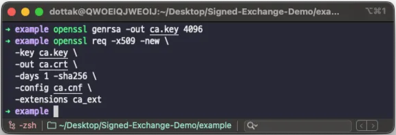

### 3.2.2 Server Certificate Generation: server.crt, server.csr, server.key

Save the following content as `server.cnf` for server certificate generation.

> The `alt_names` section defines the Subject Alternative Names (SAN) for which the certificate is valid. Since this is a local environment, we specify the `localhost` domain and local IP address `127.0.0.1`.

📄 server.cnf

```bash
[ req ]
default_bits       = 2048
prompt             = no
default_md         = sha256
distinguished_name = dn
req_extensions     = server_ext

[ dn ]
CN = Signed Exchange Demo - Server CA

[ server_ext ]
basicConstraints = critical, CA:FALSE
keyUsage = critical, digitalSignature, keyEncipherment
extendedKeyUsage = serverAuth
subjectAltName = @alt_names

[ alt_names ]
DNS.1 = localhost
IP.1  = 127.0.0.1
```

Generate the server private key (`server.key`) and Certificate Signing Request (`server.csr`), then sign with the Root CA (`ca.key`, `ca.crt`) to issue the server certificate (`server.crt`).

> A CSR (Certificate Signing Request) file is used to request certificate issuance from a Certificate Authority (CA). It contains the server's public key and basic information, and the CA verifies this and signs it to create a certificate (.crt).

```bash
# Generate server private key: server.key
openssl genrsa -out server.key 2048

# Generate Certificate Signing Request (CSR): server.csr
openssl req -new \
  -key server.key \
  -out server.csr \
  -config server.cnf

# Sign server certificate with Root CA: server.crt
openssl x509 -req \
  -in server.csr \
  -CA ca.crt -CAkey ca.key \
  -CAcreateserial \
  -out server.crt \
  -days 1 -sha256 \
  -extfile server.cnf -extensions server_ext
```

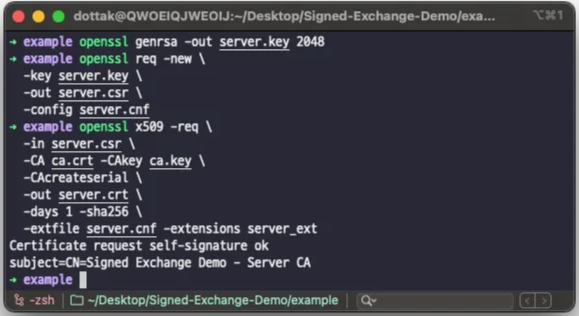

## 3.3 Signed Exchange Packaging

### 3.3.1 Prepare Resources

Prepare a static HTML file to package as SXG.

```bash
echo "<h1>Hello SXG \!\!</h1>" > index.html
```


### 3.3.2 SXG Certificate Generation: sxg.key, sxg.csr, sxg.crt

Generate the private key (`sxg.key`) and Certificate Signing Request (`sxg.csr`) for Signed Exchange, then sign with the Root CA (`ca.key`, `ca.crt`) to issue the SXG packaging certificate (`sxg.crt`).

> The `example.com` origin in the code below is the origin of the URL included in the Signed Exchange, and it is the basis for the browser to verify that the SXG was signed by `example.com`.
>
> `1.3.6.1.4.1.11129.2.1.22 = ASN1:NULL` is an SXG-specific X.509 extension defined by Google. This extension (`CanSignHttpExchanges`) explicitly declares that the certificate has authority to sign SXG.

```bash
# Generate SXG private key: sxg.key
openssl ecparam -out sxg.key -name prime256v1 -genkey

# Generate Certificate Signing Request (CSR): sxg.csr
openssl req -new -sha256 -key sxg.key -out sxg.csr \
  -subj "/CN=example.com"

# Sign SXG certificate with Root CA: sxg.crt
openssl x509 -req -in sxg.csr -out sxg.crt \
    -CA ca.crt -CAkey ca.key \
    -extfile <(echo -e "1.3.6.1.4.1.11129.2.1.22 = ASN1:NULL\nsubjectAltName=DNS:example.com")
```

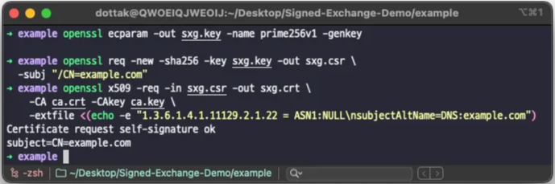

### 3.3.3 OCSP Response Generation: ocsp.der

Signed Exchange is verified based on the certificate status at the time of packaging. This is because the browser does not perform real-time OCSP queries during SXG verification; instead, a valid OCSP response must be included in the Signed Exchange.

First, create an OCSP status management index file (`index.txt`) that records the status of certificates issued by the CA.

> **What is OCSP Status Management Index?**
>
> A database file that tracks the status (valid, revoked, expired) of certificates issued by the CA.<br>
> Structure: `[status code]\t[expiry time]\t[revocation time]\t[certificate serial]\t[filename field]\t[certificate Subject DN]`
> - Status codes: `V` (valid), `R` (revoked), `E` (expired)
> - Valid certificates have no revocation time, so shown as blank (`\t\t`)

```bash
# Set variables
VALIDITY_DAYS=1
if date -u -d "+${VALIDITY_DAYS} day" >/dev/null 2>&1; then
  EXPIRE_DATE=$(date -u -d "+${VALIDITY_DAYS} day" +"%y%m%d%H%M%SZ")
else
  EXPIRE_DATE=$(date -u -v+"${VALIDITY_DAYS}"d +"%y%m%d%H%M%SZ")
fi
# OCSP identifies certificates by serial number
SERIAL=$(openssl x509 -in sxg.crt -serial -noout | cut -d= -f2)

# Create OCSP status management index: index.txt
echo -e "V\t$EXPIRE_DATE\t\t$SERIAL\tunknown\t/CN=example.com" > index.txt
```

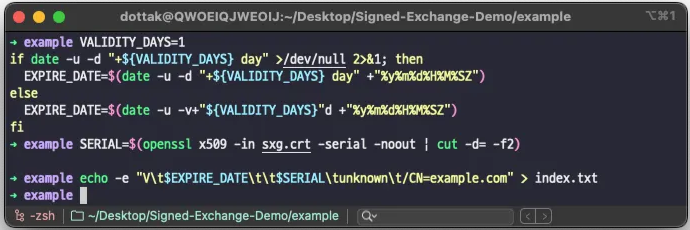

Next, determine the certificate status based on the OCSP status management index (`index.txt`) and generate the OCSP response. This uses the OpenSSL OCSP Responder.

> **What is OpenSSL OCSP Responder?**
>
> A component that queries and responds to certificate status on behalf of the CA. When it receives an OCSP request, it references the CA's certificate status management index file to determine the validity of the certificate and generates/signs an OCSP response message.<br>
> Since SXG does not perform real-time OCSP queries, the OpenSSL OCSP Responder is used to generate static OCSP responses at packaging time.

~~Choose one of the two methods below.~~ (Option 1 is recommended.)

- Option 1) [Recommended] Generate OCSP Request/Response (Static OCSP Response Generation)

    ```bash
    # Generate OCSP request: req.der
    openssl ocsp -issuer ca.crt -cert sxg.crt -reqout req.der -no_nonce

    # Generate OCSP response: ocsp.der
    openssl ocsp -index index.txt -rsigner ca.crt -rkey ca.key -CA ca.crt \
        -reqin req.der -respout ocsp.der -ndays 3
    ```

    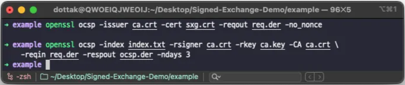

- ~~Option 2) Generate OCSP Response via Local OCSP Responder~~

    ```bash
    # Run OCSP Responder in background: port 2560
    openssl ocsp -index index.txt -port 2560 \
      -rsigner ca.crt -rkey ca.key -issuer ca.crt \
      -CA ca.crt &
    OCSP_PID=$!

    # Wait briefly for server to start
    sleep 1

    # Generate OCSP response: ocsp.der
    openssl ocsp -issuer ca.crt -cert sxg.crt \
      -url http://127.0.0.1:2560 -respout ocsp.der \
      -CAfile ca.crt

    # Terminate Responder
    kill $OCSP_PID
    ```

    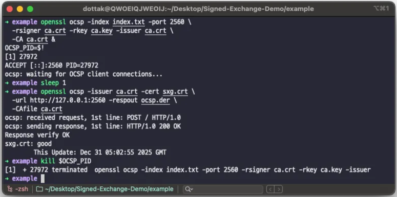

### 3.3.4 SXG Certificate Metadata Generation: cert.cbor

Combine the generated OCSP response (`ocsp.der`) with the SXG certificate and create a CBOR-formatted certificate metadata file (`cert.cbor`).

> The generated `cert.cbor` is used by the browser to verify the certificate chain and certificate status (OCSP) together during SXG verification.

```bash
gen-certurl -pem sxg.crt -ocsp ocsp.der > cert.cbor
```

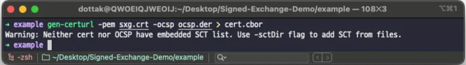

### 3.3.5 Signed Exchange (SXG) Generation: index.sxg

Package the previously created resource (`index.html`) into Signed Exchange (SXG) format.

> Option descriptions
>
> `-uri` The URL origin that the SXG claims for the content<br>
> `-content` The actual content to sign<br>
> `-certificate` The certificate used for SXG signing<br>
> `-privateKey` The private key corresponding to the certificate<br>
> `-certUrl` The URL where the certificate metadata (cert.cbor) is provided<br>
> `-validityUrl` The validity resource for SXG revalidation<br>
> `-o` The SXG file to be generated

```bash
gen-signedexchange \
  -uri https://example.com/ \
  -content index.html \
  -certificate sxg.crt \
  -privateKey sxg.key \
  -certUrl https://localhost/cert.cbor \
  -validityUrl https://example.com/resource.validity \
  -o index.sxg
```

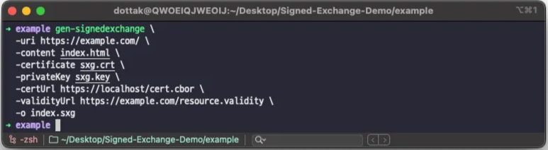

## 3.4 SXG Demonstration

### 3.4.1 Running WAS (Flask)

Write the following Flask web application code as `server.py`:

📄 server.py

```python
from flask import Flask, Response

app = Flask(__name__)

@app.route("/")
def index():
    return "Signed Exchange Demo"

@app.route("/cert.cbor")
def serve_cert():
    with open("./cert.cbor", "rb") as f:
        data = f.read()

    return Response(
        data,
        mimetype="application/cert-chain+cbor",
        headers={
            "X-Content-Type-Options": "nosniff",
            "Cache-Control": "no-store",
        }
    )

@app.route("/sxg")
def serve_sxg():
    with open("./index.sxg", "rb") as f:
        data = f.read()

    return Response(
        data,
        mimetype="application/signed-exchange;v=b3",
        headers={
            "X-Content-Type-Options": "nosniff",
            "Cache-Control": "no-store",
        }
    )

if __name__ == "__main__":
    app.run(host="0.0.0.0",port=443,
        ssl_context=("./server.crt", "./server.key"),
        debug=True
    )
```

Run with the following command:

```bash
python server.py
```

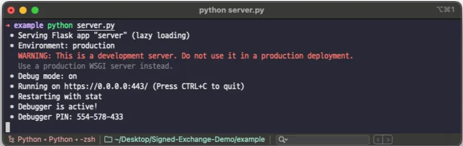

### 3.4.2 Trusting the Private Root CA Certificate

Navigate to https://localhost in Chrome browser. If you encounter `ERR_CERT_AUTHORITY_INVALID` as shown below, you need to add the Root CA certificate `ca.crt` as a trusted certificate in your browser.

> Since we are using a private CA in the practice environment, you must add the Root CA certificate created earlier as a trusted certificate in your browser for proper SXG verification.

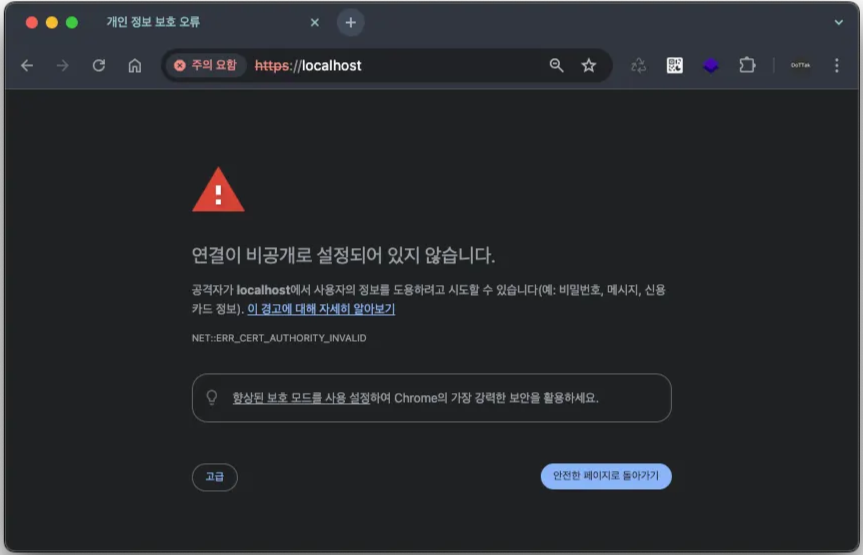

In Chrome settings, go to 'Privacy and Security' → 'Security' → 'Manage Certificates' (chrome://certificate-manager/) → 'Manage Certificates', add the Root CA certificate `ca.crt`, and change the 'Trust' setting for 'When using this certificate' to 'Always Trust'.

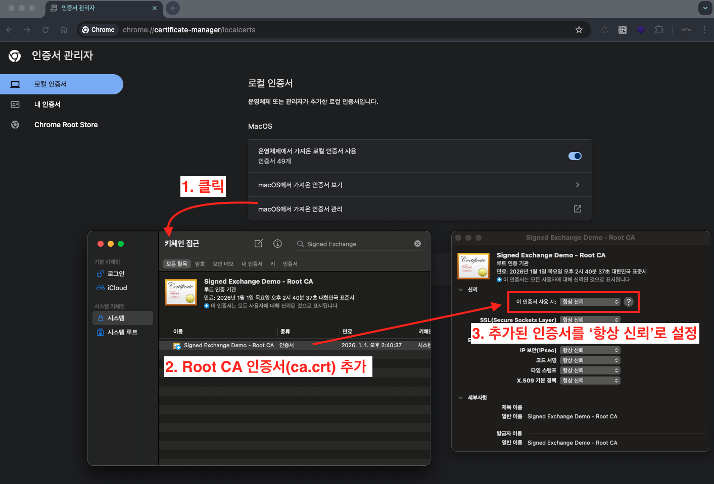

After this, when you access https://localhost again, the page will display normally.

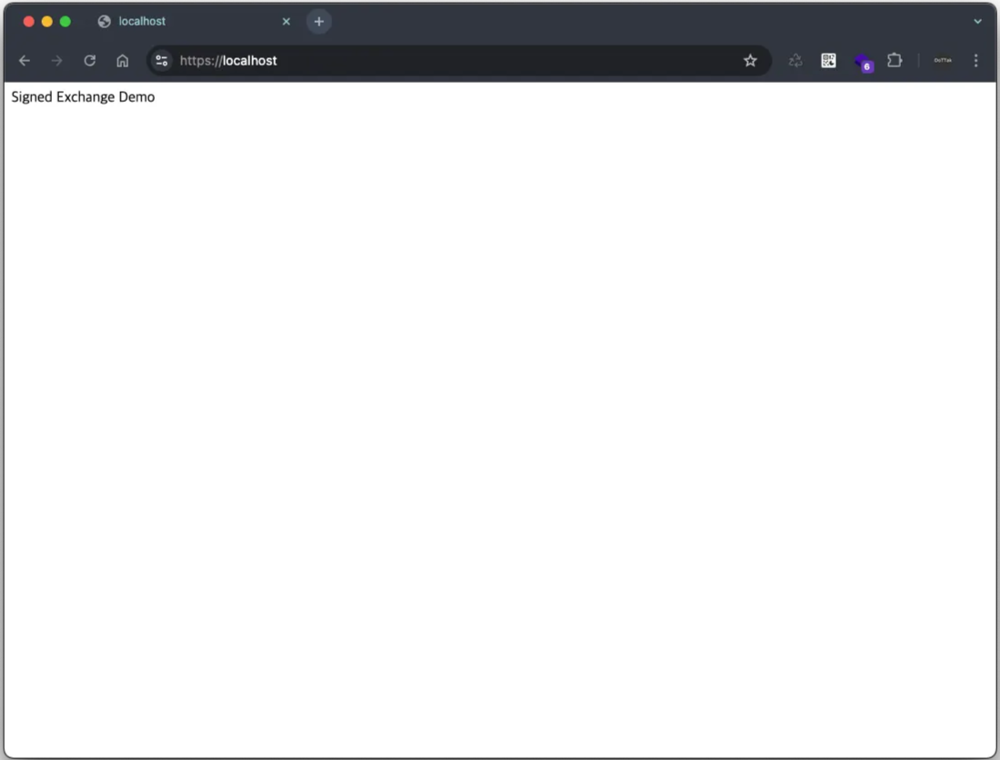

### 3.4.3 SXG Request

Now when you access the endpoint https://localhost/sxg that serves the SXG file, the URL specified in the `uri` option of the `gen-signedexchange` command will be displayed in the browser address bar.

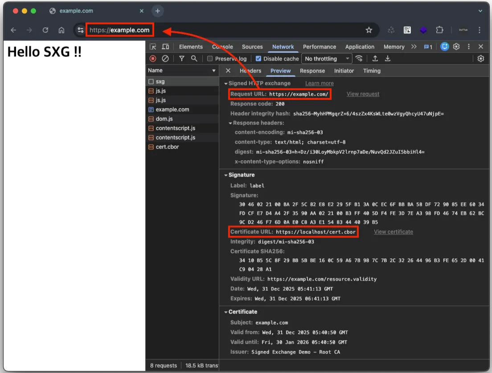

Therefore, when a user accesses https://localhost/sxg to request the SXG file, they actually receive the file from the localhost server, but the browser address bar displays `https://example.com/`. This is a key feature of SXG, demonstrating that even when a third party (localhost) provides the content, the identity of the original origin ([example.com](http://example.com)) can be maintained.

---

# References

- [How to set up Signed Exchanges using Web Packager | Articles | web.dev](https://web.dev/articles/signed-exchanges-webpackager)
- [Signed Exchanges (SXGs) | Articles | web.dev](https://web.dev/articles/signed-exchanges)
- [Signed HTTP Exchanges | Blog | Chrome for Developers](https://developer.chrome.com/blog/signed-exchanges)
- [webpackage/go/signedexchange at main · WICG/webpackage](https://github.com/WICG/webpackage/tree/main/go/signedexchange#creating-our-first-signed-exchange)
- [How to Use Signed HTTP Exchanges (SXG) to Steal User Cookie — With Challenge Example](https://medium.com/@0x3en70rs/how-to-use-signed-http-exchanges-sxg-to-steal-user-cookie-with-challenge-example-19b313974257)
- [SECCON CTF 14(2025) Quals Writeup - Qiita](https://qiita.com/Liesegang/items/9b52589c57fd7da5dd67)
